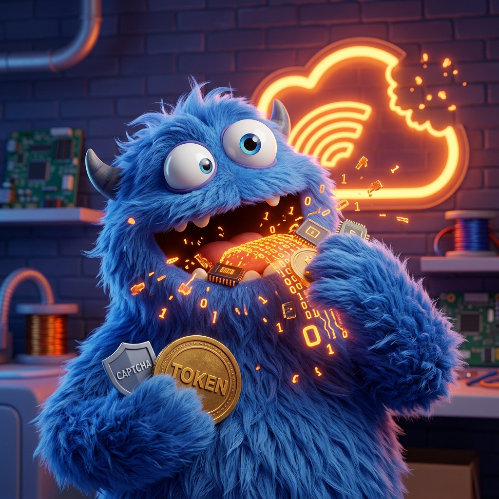

# Recursive Context Poisoning (Token Monster) Diagnostic Suite (v2.5)



### **The Problem: Recursive Context Poisoning**
CodeXMonster is a forensic diagnostic suite designed to isolate and prove the "Token Monster" bug in OpenAI Codex. This issue occurs when a **Networking Fingerprint Mismatch** triggers a Cloudflare WAF block on background workers, causing the application to absorb 403 HTML as context. This lead to a recursive failure loop that consumes millions of tokens and results in catastrophic chat history loss.

---

## **Diagnostics v2.5: Advanced Forensic Audit**
The core tools in this suite are **Check-CodexBug.ps1** (Windows) and **Check-CodexBug.sh** (Linux/macOS). Unlike simple log viewers, these scanners perform a deep SQLite audit to calculate the "Price of the Loop."

### **Example Diagnostic Output (Captured Prior to Pruning):**
> [!NOTE]
> The data below reflects a "Peak Loop" capture. Codex regularly prunes its own SQLite database to avoid disk crashes; your current results may appear smaller if a pruning event has recently cleared the most heavy failure logs.

```text
--- Recursive Context Poisoning Diagnostic v2.5 ---
Calculating Sanitized Bi-Directional Token Waste...
[+] Codex Process detected.

--- COMMUNITY EVIDENCE BLOCK ---
Issue Tracking: https://github.com/openai/codex/issues/17880
Diagnostic Result: POSITIVE (Recursive Context Poisoning Detected)
Cloudflare Background Blocks: 13
Bi-Directional Token Tax: ~34,025 tokens (Applied to every message send/receive)
Estimated Cumulative Overhead: ~45,117,150 tokens consumed by recursive failures.
Compaction Velocity: 0.9% (12 compactions / 1326 messages)

--- HOURLY LOOP INTENSITY (LAST 24HRS - PEAK) ---
[2026-04-16 23:00] 14 events
[2026-04-16 21:00] 2 events
[2026-04-16 18:00] 4 events
[2026-04-16 14:00] 6 events
[2026-04-16 10:00] 12 events

[!] VERDICT: POSITIVE.
This evidence proves that your background daemon is poisoning your context window with WAF HTML.
```

### **Understanding the Metrics:**
*   **Bi-Directional Token Tax**: This is the static token count of the Cloudflare HTML currently stored in your logs. It is added to **every single message** you send and receive.
*   **Estimated Cumulative Overhead**: This is the "Ghost in the Machine." Because context is recursive, a 34k "Tax" multiplied by 1,300 messages creates **45 Million tokens** of wasted compute.
*   **Compaction Velocity**: Healthy apps compact context ~1% of the time. If your velocity is high, the "Monster" is eating your history.

---

## **How to Run**

### **Windows (PowerShell)**
1. Open **PowerShell** as **Administrator**.
2. Run the following:
```powershell
Set-ExecutionPolicy -ExecutionPolicy Bypass -Scope Process -Force
& "./Check-CodexBug.ps1"
```

### **Linux / macOS (Bash)**
1. Ensure `sqlite3` is installed on your system.
2. Open your terminal and run:
```bash
chmod +x ./Check-CodexBug.sh
./Check-CodexBug.sh
```

## **Integrity & Safety**
To ensure you are running the authentic, un-modified script, verify the file hash before execution:

### **Official SHA-256 Checksums (v2.5)**
- **Check-CodexBug.ps1**: `C89F3E73B787E538B777623CAE280472022BD863BEFE6312AD85CD27A5B11BC6`
- **Check-CodexBug.sh**: `8546FCC3E66291BC465F388D1E92E8DDB35972F18CC5519DA5FA7229DD008827`

---

## **Contributing Your Evidence**
If you receive a **POSITIVE** verdict, copy your **COMMUNITY EVIDENCE BLOCK** and post it to [OpenAI GitHub Issue #17880](https://github.com/openai/codex/issues/17880) to help the engineering team finalize a fix for the background networking stack.

## ⚖️ License & Acknowledgements
- **License**: [MIT](LICENSE)
- **Special Thanks**: Deep gratitude to **[Tim Perry](https://github.com/pimterry)** for granting an educational license for **[HTTP Toolkit](https://github.com/httptoolkit/httptoolkit)**. This forensic audit and the identification of the TLS Fingerprint Mismatch would not have been possible without these professional interception tools.
- **Acknowledgements**: 
  - **CoDeX** is a trademarked application developed by **OpenAI**.
  - **Cloudflare** is a registered trademark of **Cloudflare, Inc**.
  - This diagnostic tool is an unofficial community contribution and is not affiliated with, endorsed by, or sponsored by OpenAI or Cloudflare.
